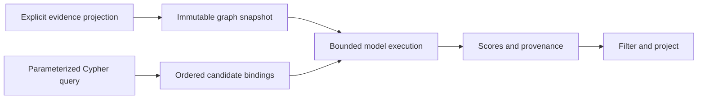

# Execution semantics

Orbweaver Query supplies an explicit-path model backend, a structural neighborhood
backend, and a read-only Neo4j adapter. Python bindings are the composition surface. Cypher
parsing, matching, aggregation and ordinary projection remain Neo4j's work.
There is no custom Cypher function installed on the server and no claim of
ISO GQL conformance. Other database adapters can supply the same string-ID
bindings and immutable graph projection without adopting Neo4j internals.

## Evidence and candidates

`GraphSnapshot` declares ordered node IDs, ordered relation names and directed
typed triples. Identical triples collapse as evidence-set duplicates; distinct
types between the same pair remain. Inverse traversal symbols are derived from
forward edges; they are not extra asserted facts. Self edges are rejected by
this backend. Isolated declared nodes are retained. Arrays are immutable and
content identities include schema order and the actual packed graph.

The explicit-path scorer considers two- and three-step reachability, excluding
the source and all already adjacent nodes. Its random-walk features require the
full evidence context, including boundary degrees and other neighbors. Limiting
the candidate query does not authorize cropping the evidence graph. Filtering
candidate rows or scores changes returned rows, not the underlying model score.

`NeighborhoodModel` ignores edge types and direction, and scores all non-self,
non-adjacent nodes. It computes common neighbors, Adamic–Adar or resource allocation
from the same full topology. Disconnected pairs have valid zero scores. Bound
pairs use neighbor intersection; full-source execution uses exact accumulation.
For many bound targets, a topology-only work estimate can select a full traversal
followed by projection when that kernel fits every resource limit. This changes
work performed, not the evidence domain or any returned score; it is a heuristic.
The three metrics share immutable features, but have distinct model identities.

`Session` binds one graph and model. Different graph content, ordered relation
schema or coefficient values produce different content identities. There is no
global cache. An optional caller-owned `BindingCache` reuses exact pair scores
across calls using graph/model identities and endpoint/relation indices. Its LRU
entry limit is not a byte or process-memory limit. Old snapshot entries remain
unreachable by new snapshot identities until eviction or `clear()`. Caller-owned custom models
must obey the documented deterministic, source-only expansion contract; a model
with relation-conditioned expansion requires a different grouping key/backend.

## Operators

- `Session.run([LinkQuery(...)])` returns a scored candidate set per input request.
- `score_bindings(session, rows)` scores the explicit `head/relation/target`
  columns and retains every other binding field.
- `result.where_score(minimum)` retains supported rows whose score is at least
  the threshold. A score threshold is a ranking filter, not a confidence policy.
- `result.project("head", "target")` selects input fields while retaining each
  prediction's score/status, graph identity and model identity. An empty
  projection retains only prediction metadata; unknown fields raise an error.
- `result.to_records()` adds a nested `prediction` field. A collision with an
  existing input field raises an error; choose `prediction_column=` explicitly.

For example, `score_bindings(session, rows).where_score(0).project("head",
"target").to_records()` composes inference, filtering and projection. Filtering
and projection retain order and duplicate row occurrences. They do not deduplicate
or aggregate. Profile counters describe the inference work before post-filters.
Bindings are shallow copies: caller-owned nested metadata is not deep-frozen.

## Nulls, unknown inputs and ties

Any null scoring argument short-circuits that row to `null_input`, with a null
score. Otherwise all three inputs must be strings in the declared graph/model
schema. Unknown node IDs, unknown relation names and malformed bindings are
errors. Known targets outside candidate support yield `unsupported`, also with
a null score. These cases must not be turned into negative facts or zero scores.

Supported path scores are finite ranking logits; neighborhood scores are finite
structural link scores. Neither is a calibrated probability.
`LinkResult.top(k)` breaks equal scores by external candidate ID, independent of
internal integer assignment. The model evaluation's expected recall under random
ties is a different, explicitly documented reporting convention.

## Planning, limits and profiling

`QueryPlan(graph)` composes named `predict` operators, conjunctive `where_score`
filters and terminal `project`. All declared input columns are read from the
candidate binding, not from other predictions. Output aliases must be unique
and cannot collide with input columns. Every declared input is validated before
any prediction in a window, including rows that an early filter would remove.
Null short-circuiting applies separately to each prediction's three inputs.
A threshold rejects null and unsupported scores; an unfiltered operator retains
them with their distinct status. Projection can select input fields and named
predictions; an empty projection preserves one empty mapping per surviving row.

The physical planner shares preparation only when models declare the same
feature contract and support, and use the same source/target input columns.
Features cannot depend on the requested relation; relation-specific scoring is
still performed separately. Model IDs include all scoring choices. A custom
backend without `feature_id` shares only within its own model identity. The
optional `expand_targets` contract must agree with full expansion for each
requested endpoint. Models must be pure and features immutable.

Without supplied statistics, groups containing score filters run before groups
without filters, with stable declared order within each category. Within each
group, filtered predictions run first, also retaining declared ties. A rejected
row skips later predictions in that group. Source preparation is created lazily
and retained for that source's surviving operators; the executor does not retain
expanded features for the whole input window. Cached threshold scores can reject
rows without creating source features or looking up later model scores. All
declared input schemas are still validated before any of these transformations.

Within each bounded scoring batch, a feature group evaluates one stable
representative for each distinct tuple of its validated prediction arguments.
All relation and null patterns participate in that tuple. Row payloads do not:
models are pure functions of their declared arguments and immutable evidence.
The executor restores every surviving duplicate in its original position with
its own payload and later predictions. No row or candidate is dropped by this
optimization, and representatives do not survive across scoring batches.
`binding_evaluations` counts representative bindings, including null and
unsupported inputs; `duplicate_bindings` counts the eliminated repetitions.
These are executor counters, distinct from model calls and inference work.

`plan.calibrate(sample)` consumes at most one input window and measures each
physical group independently on that sample, including its filters. Statistics
are bound to the full plan, graph/model identities, limits, and fusion setting.
`run(..., statistics=...)` orders groups by measured cost divided by rejection
fraction; unfiltered groups sort last. This heuristic does not model conditional
selectivity or promise an optimal order. Calibration cost is separate from query
cost and must be included in amortization comparisons. Filtering may avoid later
model work, including a limit failure that would occur in another physical order;
completed answers preserve the same semantics. Projection always follows filtering.

`plan.explain()` describes logical operators and physical groups, contracts,
thresholds and supplied statistics. `PlanResult.report()` gives per-window/group
input/output counts, expansions, scoring calls and wall time. `feature_bytes`
is the largest final source feature array set in that step, not temporary or
process memory. `run(..., cache=...)` and `iter_batches(..., cache=...)` accept the
same caller-owned `BindingCache` as the binding API. They commit newly computed
scores only after all operators in a window succeed. Cached raw scores remain
valid across filter/projection changes, but graph/model changes miss by content
identity. Cache profile counts describe unique LRU lookups per group; null rows
never look up a score. Shared input columns are validated once per window row,
without weakening validation for other declared columns. Pair plans alone have
no joins; `expand` adds the graph pipeline described below. Database-side
inference, prediction-generated edges and arbitrary relational joins remain
outside the supported scope.

### Prediction-dependent graph pipelines

`QueryPlan.expand` returns an immutable `GraphPipeline`. Logical inference stages
are separated by joins to typed edges in the same immutable graph snapshot.
`source` is an existing node-ID column; `target` is a fresh node-ID output.
`relation=None` admits every type; a fixed relation must belong to the graph.
`direction` is `out`, `in` or `both`. `edge_relation` optionally binds the matched
type to another fresh column. Outputs cannot shadow any input or earlier output;
prediction objects cannot be used as node/relation IDs. A filter declared in an
inference stage must name a prediction in that stage.

Each expansion emits one row per matching directed typed evidence edge. Identical
input triples have already collapsed in GraphSnapshot; distinct types and
reciprocal edges remain distinct. BOTH can therefore emit duplicate endpoints.
Rows retain parent order, then ascending target node index and edge symbol
(forward types before inverse types for a shared target). Repeated parent rows
produce repeated bags. Chaining expansions permits revisiting an edge or node;
there is no implicit path uniqueness constraint. Ordinary expansion drops a
null source or a parent without matches. `optional=True` emits exactly one row
with null output bindings in that case. It does not preserve a parent whose
matched children are subsequently rejected by a score filter.

The physical planner can move a thresholded prediction to the earliest stage
where all three inputs exist. Only typed graph-expansion boundaries are crossed;
model purity and exact target-preparation contracts are required as for pair
plans. Filters depending on an expanded column stay downstream of its producer.
Optional joins also permit movement of a parent-only filter. Unfiltered models
remain in their logical stages; there is no speculative reordering of expensive
unfiltered work. Physical movement can change which resource budget is reached,
but never the output of a completed exact execution. `optimize=False` retains
logical stage placement; `fused=False` disables within-stage feature sharing.
Measured pair-plan statistics do not currently schedule pipeline stages.

Root rows are copied and their declared external dependencies and output-name
collisions checked before any stage executes. Null external inputs short-circuit
that prediction's other external values, as for pair plans. Otherwise external
IDs are validated immediately, even if a later optional expansion will bind a
null argument. A future generated null does not conceal an invalid root ID.
Generated bindings are validated by each inference stage before model work.
Projection is terminal and its input columns are checked during root preflight.
The final record columns follow logical declaration order even after movement.

Execution consumes at most `window_size` root rows, then materializes bounded
stages for that window. Each expansion must stay within `max_intermediate_rows`
(default 100,000), `max_neighbor_visits` and `max_type_visits`; none is a truncation
policy. Model batches still contain at most `window_size` rows. These are row/work
bounds, not a total byte limit: input, output and pending cache entries can coexist.
No result or newly computed cache entry from a root window becomes visible until
all its stages succeed. Earlier successful root windows remain committed if a
later window fails. Cache-hit counters/LRU read ordering can still change on a
failed window, as with pair plans. Output batches contain at most `window_size`
rows; the first batch for each root window owns its complete stage profiles.

`explain()` shows logical and physical stages, dependencies, predicate moves,
snapshot identity and bounds. `report()` distinguishes `predict` and `expand`
steps, labels stage numbers, and counts typed `edge_visits` separately from model
feature work. Expansion edge visits include inspected edges rejected by a type or
direction condition. A lower work count is not itself a latency result.

For models with `prepare_source` or `prepare_targets`, the pipeline can retain
intermediate inference state within a root window. It predicts reuse when the same
source occurs in more than one scoring batch; this is a heuristic, not an optimal
cost model. With `prepare_targets`, it collects the union of known stage targets,
omitting pairs already resolved in the answer cache or pending window results.
The first required completion prepares exact features for that union; each scoring
batch then receives only its subset. Retained domains are checked before reuse,
and a later stage requesting new targets may rebuild preparation. The hint is
computed before within-stage filters, so some prepared targets may subsequently
be rejected. Preparation stays lazy when no surviving row needs features.

The path backend supports both target-union features and complete two-hop walk
prefixes. `coalesce_targets=False` selects prefix reuse without union preparation;
models without `prepare_targets` also retain their source-only behavior. Neither
state stores model-specific prediction scores. Compatible coefficient models can
share state through explicit preparation and feature identities. Graph,
preparation, feature, support and source identities participate in the reuse key.
The scope is discarded at the end of the root window and cannot outlive a request.

`Limits.max_prepared_bytes` caps retained numeric intermediate arrays, default
16 MiB. The bound includes retained target indices and feature arrays as well as
prefix arrays. Zero disables retention. Python containers, evidence and transient
construction/subset memory are outside that numeric bound. An oversized state
is used for its current completion and discarded; later batches fall back to
ordinary bound-target preparation rather than rebuilding it repeatedly. Eviction
uses least-recently-used source state. `reuse_preparation=False` disables this
execution strategy. Preparing a complete prefix or a target union can reach a
work/state limit where smaller target batches would succeed; that is an explicit
exact-execution failure, not candidate truncation.

Profiles charge retained-state construction once and each completion's new type visits
separately, while checking the preparation-plus-completion work against model
limits. They report `preparation_builds`, `preparation_hits` and retained numeric
`preparation_bytes`; the aggregate reports their peak. `target_preparation_builds`
and `target_preparation_hits` identify the target-union subset of those totals.
Final score reuse remains
the separate `BindingCache` contract. Before preparing features, inference groups
exclude pairs already present in that cache or the window's pending results, so
new graph-join duplicates do not force needless recomputation of known targets.

`session.explain(strategy=...)` describes the inference operator's reuse keys,
snapshot/model identities, support and limits. It is not the database's Cypher
execution plan. `result.report()` describes inference counters and elapsed time;
binding results expose the corresponding per-window profiles.

`independent` expands for each request. `consecutive` keeps one source's features
for neighboring requests. `grouped` reorders compatible sources within each
bounded window, reuses identical source/relation scores, and restores input
order and multiplicity. All three use the same evidence and exact scoring rule.

Binding execution defaults to `execution="auto"`: use a backend's exact
`expand_targets` capability when present; otherwise use full source expansion.
`execution="full"` forces the latter; `"targeted"` requires the former. The
explicit-path implementation discards only terminal states for unrequested
endpoints and two-hop states that cannot reach any requested endpoint on the
last step. Degrees and edge-type multiplicities always come from full evidence.
A backend may also supply a sufficient `rejects_pair` check. The path backend
rejects self-pairs and existing neighbors before expanding any paths. This is
exact support validation, not approximate pruning. Profiles identify `all` or
`bound_targets` candidate preparation. Grouped binding
execution also deduplicates identical scoring requests within a window, then
restores every input row. Profile query counts describe executed requests.

Persistent cache hits validate input schemas first, require no new expansion,
and preserve null/unsupported distinctions. A failed window does not commit
partial newly computed predictions. Artifact identities are the backend's
purity contract; custom models must change their identity when scores change.
Backends without explicit score/support metadata report `backend_score` and
`backend_defined` instead of inheriting path-model claims.

`Limits.window_size` bounds the input window. `max_expansion_states` and
`max_type_visits` and `max_neighbor_visits` fail exact inference explicitly; they never truncate a result
or silently produce an approximation. Final numeric feature bytes in profiles
are not peak process memory. `run`/`score_bindings` collect complete outputs;
`iter_batches`/`iter_score_bindings` support bounded retention when callers also
consume and release batches. A single source can still exceed an expansion limit.

## Database boundary

The adapter uses explicit read transactions and requires a database `EXPLAIN`
classification of read-only before running a supplied statement. It does not
rewrite or repair Cypher. Procedures/functions depend on the actual server and
installed extensions. Input parameters use the driver parameter mapping.

Evidence nodes and edges are queried within one transaction. The resulting
snapshot is immutable, but this does not strengthen the database's transaction
isolation or coordinate concurrent writers. Callers control transaction timeout
and database privileges through their database configuration and driver setup.
The adapter never writes graph data and never closes the caller's driver.

Candidate generators close their transaction on exhaustion, exception or
explicit `close()`. Close the generator when stopping early. The model's graph
projection uses stable application IDs rather than internal Neo4j entity IDs.
Generic candidate reads retain the database's original graph objects; consumers
must map them explicitly into the scoring contract.

`Neo4jSource.run_plan` collects a composed plan over one candidate read;
`iter_run_plan` streams its bounded output windows. Both close the candidate
generator if model execution or validation fails. Closing `iter_run_plan` early
also closes the read transaction and session. Parameters, read-only classification,
row semantics, cache options and evidence identity follow the same contracts as
their separate APIs. Running a new candidate query never refreshes an old evidence
snapshot implicitly, and neither method closes the caller-owned driver.
