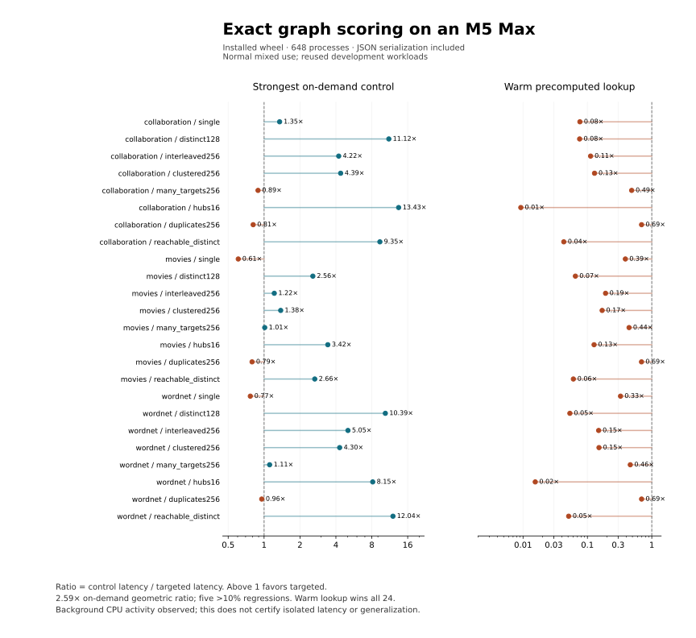

# Mac installed-wheel performance demonstration

**Descriptive result under normal mixed use:** exact target-aware scoring observed a
**2.59× geometric speedup** against the fastest applicable full-expansion/LRU
control in each of 24 fixed conditions. Every one of 648 workers agrees on
rows, support/status and provenance, with score error at most 8.88e-16. Five
conditions have over 10% greater latency. Warm precomputation is faster in all 24.
No isolated-performance, generalization, predictive-quality or completed 1.0 claim follows.

Host: Apple M5 Max (`Mac17,7`), 128 GiB, macOS 26.6.2, native ARM Python 3.11.15,
NumPy 2.4.6. Nine arms, three processes per graph/workload/arm, one first call
plus three measured calls each. Total execution took 178 seconds. Benchmark code
and protocol were committed in `dbd287e` before measurement. The wheel was built
from the source archive; each worker verifies its installed runtime against it.

Aggregate background process CPU observations ranged from 267.3% to 622.8% at
worker boundaries (summed across processes; this is not total-machine utilization).
The run was deliberately labeled `normal-mixed-use` and was not repeated to select
a cleaner/faster outcome. Thermal/load telemetry and every sample remain in the archive.
These diagnostics do not isolate contention effects. The conditional bootstrap
95% interval is 2.430–2.659×;
it only resamples three process medians within these reused development workloads.



## Practical class: distinct, supported candidate pairs

Every requested target in these three conditions is supported. The comparison
is therefore not just a fast rejection of self-pairs or adjacent nodes.

| Graph | Rows | Best on-demand arm | Control ms | Targeted ms | Observed ratio |
| --- | ---: | --- | ---: | ---: | ---: |
| collaboration | 113 | lru16m | 68.009 | 7.273 | 9.35× |
| movies | 128 | full | 15.742 | 5.917 | 2.66× |
| wordnet | 128 | full | 81.561 | 6.775 | 12.04× |

On WordNet in this class, both full and targeted execution make 128 model calls.
Full expansion produces 25,485 candidate scores; targeting produces 128.
Counted type visits fall from 52,579 to 12,689 and peak final numeric feature
arrays from 72,808 to 280 bytes. This locates work avoided inside feature
construction/scoring; it does not equate those arrays with process memory or
isolate a per-optimization causal speedup. All intermediate evidence/normalization
is retained, and independent random-walk tests check the model contract.

## Complete condition table

Ratios above one favor targeted execution. All request timings include result
construction, `to_records`, JSON serialization and UTF-8 encoding. Artifact
loading, interpreter startup, data download and Neo4j export/query/transfer are
outside this boundary. `results.json` includes per-arm load, preparation, first
request, loaded first use, process medians and peak RSS. No result is discarded.

| Graph / workload | Rows / scored | Best on-demand | Control ms | Targeted ms | Ratio | Warm pair ms | Warm oracle ms |
| --- | ---: | --- | ---: | ---: | ---: | ---: | ---: |
| collaboration / single | 1 / 1 | lru64k | 0.147 | 0.109 | 1.350× | 0.019 | 0.008 |
| collaboration / distinct128 | 128 / 37 | full | 53.870 | 4.846 | 11.116× | 0.575 | 0.367 |
| collaboration / interleaved256 | 256 / 78 | lru16m | 22.620 | 5.355 | 4.224× | 1.030 | 0.600 |
| collaboration / clustered256 | 256 / 78 | full | 23.242 | 5.300 | 4.385× | 0.995 | 0.684 |
| collaboration / many_targets256 | 256 / 78 | full | 1.170 | 1.316 | 0.890× | 0.794 | 0.640 |
| collaboration / hubs16 | 16 / 4 | full_guarded | 64.853 | 4.829 | 13.431× | 0.076 | 0.045 |
| collaboration / duplicates256 | 256 / 0 | full_guarded | 0.721 | 0.890 | 0.810× | 0.744 | 0.618 |
| collaboration / reachable_distinct | 113 / 113 | lru16m | 68.009 | 7.273 | 9.351× | 0.491 | 0.312 |
| movies / single | 1 / 0 | lru_guarded | 0.013 | 0.021 | 0.607× | 0.017 | 0.008 |
| movies / distinct128 | 128 / 81 | lru_guarded | 11.874 | 4.631 | 2.564× | 0.495 | 0.301 |
| movies / interleaved256 | 256 / 162 | lru_guarded | 4.468 | 3.670 | 1.217× | 0.932 | 0.702 |
| movies / clustered256 | 256 / 162 | full | 4.787 | 3.473 | 1.378× | 1.027 | 0.588 |
| movies / many_targets256 | 256 / 78 | full | 1.222 | 1.206 | 1.013× | 0.973 | 0.535 |
| movies / hubs16 | 16 / 1 | full | 1.172 | 0.343 | 3.422× | 0.077 | 0.043 |
| movies / duplicates256 | 256 / 0 | full_guarded | 0.693 | 0.874 | 0.793× | 0.893 | 0.605 |
| movies / reachable_distinct | 128 / 128 | full | 15.742 | 5.917 | 2.660× | 0.532 | 0.358 |
| wordnet / single | 1 / 0 | full_guarded | 0.016 | 0.021 | 0.767× | 0.019 | 0.007 |
| wordnet / distinct128 | 128 / 68 | full_guarded | 65.212 | 6.275 | 10.392× | 0.535 | 0.335 |
| wordnet / interleaved256 | 256 / 148 | lru16m | 23.148 | 4.584 | 5.049× | 1.092 | 0.685 |
| wordnet / clustered256 | 256 / 148 | lru_guarded | 19.770 | 4.596 | 4.302× | 1.018 | 0.695 |
| wordnet / many_targets256 | 256 / 145 | lru16m | 1.601 | 1.439 | 1.113× | 0.931 | 0.667 |
| wordnet / hubs16 | 16 / 2 | lru_guarded | 23.735 | 2.914 | 8.145× | 0.076 | 0.045 |
| wordnet / duplicates256 | 256 / 0 | lru_guarded | 0.825 | 0.863 | 0.956× | 0.800 | 0.600 |
| wordnet / reachable_distinct | 128 / 128 | full | 81.561 | 6.775 | 12.039× | 0.495 | 0.346 |

## Regressions over 10%

- collaboration / many_targets256: 12.4% greater latency.
- collaboration / duplicates256: 23.4% greater latency.
- movies / single: 64.6% greater latency.
- movies / duplicates256: 26.1% greater latency.
- wordnet / single: 30.5% greater latency.

## All arms, setup and memory

Warm arms have already computed answers. Their preparation is charged separately;
precomputed lookup knows the entire source/relation working set and omits repeated
schema validation. It is a warm floor, not a free first-request baseline.
RSS is whole-process peak; numeric retention is a different, narrower counter.
Loaded first use includes artifact loading, warm-arm preparation and the first
serialized request, but still excludes interpreter/import startup and graph export.

| Graph / workload | Arm | Request ms | Load ms | Prep ms | Loaded first use ms | Peak RSS MiB |
| --- | --- | ---: | ---: | ---: | ---: | ---: |
| collaboration / single | cached_cold | 0.113 | 8.902 | 0.000 | 9.305 | 41.4 |
| collaboration / single | cached_warm | 0.019 | 7.929 | 0.287 | 8.280 | 41.4 |
| collaboration / single | full | 0.172 | 8.223 | 0.000 | 8.684 | 41.7 |
| collaboration / single | full_guarded | 0.189 | 8.515 | 0.000 | 8.937 | 41.3 |
| collaboration / single | lru16m | 0.150 | 8.448 | 0.000 | 8.803 | 41.4 |
| collaboration / single | lru64k | 0.147 | 6.939 | 0.000 | 7.290 | 41.4 |
| collaboration / single | lru_guarded | 0.161 | 8.132 | 0.000 | 8.640 | 41.3 |
| collaboration / single | precomputed | 0.008 | 8.320 | 0.295 | 8.657 | 41.4 |
| collaboration / single | targeted | 0.109 | 8.509 | 0.000 | 8.838 | 41.4 |
| collaboration / distinct128 | cached_cold | 4.075 | 7.417 | 0.000 | 12.051 | 41.5 |
| collaboration / distinct128 | cached_warm | 0.575 | 9.092 | 5.732 | 15.665 | 41.5 |
| collaboration / distinct128 | full | 53.870 | 9.028 | 0.000 | 69.763 | 43.5 |
| collaboration / distinct128 | full_guarded | 56.339 | 8.473 | 0.000 | 62.419 | 43.7 |
| collaboration / distinct128 | lru16m | 83.171 | 7.741 | 0.000 | 95.395 | 44.9 |
| collaboration / distinct128 | lru64k | 81.494 | 8.625 | 0.000 | 98.216 | 44.0 |
| collaboration / distinct128 | lru_guarded | 55.128 | 8.659 | 0.000 | 64.779 | 44.0 |
| collaboration / distinct128 | precomputed | 0.367 | 8.467 | 87.774 | 96.713 | 43.8 |
| collaboration / distinct128 | targeted | 4.846 | 8.740 | 0.000 | 14.213 | 41.4 |
| collaboration / interleaved256 | cached_cold | 5.353 | 8.364 | 0.000 | 14.968 | 41.7 |
| collaboration / interleaved256 | cached_warm | 1.030 | 8.474 | 6.441 | 16.143 | 41.6 |
| collaboration / interleaved256 | full | 25.284 | 8.170 | 0.000 | 35.188 | 43.3 |
| collaboration / interleaved256 | full_guarded | 25.567 | 8.331 | 0.000 | 33.151 | 43.2 |
| collaboration / interleaved256 | lru16m | 22.620 | 6.999 | 0.000 | 31.000 | 43.6 |
| collaboration / interleaved256 | lru64k | 214.418 | 8.695 | 0.000 | 230.148 | 44.1 |
| collaboration / interleaved256 | lru_guarded | 28.684 | 9.245 | 0.000 | 39.414 | 43.5 |
| collaboration / interleaved256 | precomputed | 0.600 | 7.922 | 24.860 | 33.483 | 43.1 |
| collaboration / interleaved256 | targeted | 5.355 | 8.432 | 0.000 | 15.021 | 41.8 |
| collaboration / clustered256 | cached_cold | 4.824 | 7.622 | 0.000 | 13.588 | 41.7 |
| collaboration / clustered256 | cached_warm | 0.995 | 8.365 | 5.983 | 15.797 | 41.7 |
| collaboration / clustered256 | full | 23.242 | 7.567 | 0.000 | 32.563 | 43.2 |
| collaboration / clustered256 | full_guarded | 26.121 | 8.649 | 0.000 | 36.008 | 43.5 |
| collaboration / clustered256 | lru16m | 27.064 | 8.473 | 0.000 | 37.035 | 43.6 |
| collaboration / clustered256 | lru64k | 76.250 | 7.248 | 0.000 | 84.972 | 43.6 |
| collaboration / clustered256 | lru_guarded | 23.404 | 7.504 | 0.000 | 32.751 | 43.4 |
| collaboration / clustered256 | precomputed | 0.684 | 9.314 | 28.344 | 38.425 | 43.1 |
| collaboration / clustered256 | targeted | 5.300 | 8.417 | 0.000 | 14.988 | 41.7 |
| collaboration / many_targets256 | cached_cold | 1.349 | 8.491 | 0.000 | 11.088 | 41.6 |
| collaboration / many_targets256 | cached_warm | 0.794 | 7.428 | 1.155 | 10.000 | 41.7 |
| collaboration / many_targets256 | full | 1.170 | 7.502 | 0.000 | 9.528 | 41.6 |
| collaboration / many_targets256 | full_guarded | 1.219 | 7.273 | 0.000 | 9.533 | 41.6 |
| collaboration / many_targets256 | lru16m | 1.272 | 8.137 | 0.000 | 9.693 | 41.6 |
| collaboration / many_targets256 | lru64k | 1.318 | 8.548 | 0.000 | 10.105 | 41.5 |
| collaboration / many_targets256 | lru_guarded | 1.339 | 8.581 | 0.000 | 10.874 | 41.6 |
| collaboration / many_targets256 | precomputed | 0.640 | 8.285 | 0.303 | 9.260 | 41.5 |
| collaboration / many_targets256 | targeted | 1.316 | 8.170 | 0.000 | 10.622 | 41.5 |
| collaboration / hubs16 | cached_cold | 4.817 | 8.100 | 0.000 | 13.876 | 41.5 |
| collaboration / hubs16 | cached_warm | 0.076 | 8.272 | 6.116 | 14.556 | 42.0 |
| collaboration / hubs16 | full | 65.852 | 8.360 | 0.000 | 74.369 | 43.5 |
| collaboration / hubs16 | full_guarded | 64.853 | 8.102 | 0.000 | 75.624 | 43.6 |
| collaboration / hubs16 | lru16m | 116.116 | 7.387 | 0.000 | 132.231 | 45.2 |
| collaboration / hubs16 | lru64k | 147.499 | 8.648 | 0.000 | 157.692 | 43.8 |
| collaboration / hubs16 | lru_guarded | 65.462 | 8.670 | 0.000 | 78.178 | 44.0 |
| collaboration / hubs16 | precomputed | 0.045 | 8.330 | 150.376 | 159.149 | 44.0 |
| collaboration / hubs16 | targeted | 4.829 | 7.862 | 0.000 | 13.608 | 41.5 |
| collaboration / duplicates256 | cached_cold | 0.903 | 8.626 | 0.000 | 10.320 | 41.5 |
| collaboration / duplicates256 | cached_warm | 0.744 | 6.783 | 0.461 | 8.687 | 41.6 |
| collaboration / duplicates256 | full | 0.903 | 8.866 | 0.000 | 10.785 | 41.5 |
| collaboration / duplicates256 | full_guarded | 0.721 | 6.583 | 0.000 | 7.314 | 41.5 |
| collaboration / duplicates256 | lru16m | 1.233 | 8.289 | 0.000 | 9.702 | 41.6 |
| collaboration / duplicates256 | lru64k | 1.088 | 7.293 | 0.000 | 8.768 | 41.6 |
| collaboration / duplicates256 | lru_guarded | 0.760 | 7.271 | 0.000 | 8.127 | 41.5 |
| collaboration / duplicates256 | precomputed | 0.618 | 8.439 | 0.355 | 9.451 | 41.5 |
| collaboration / duplicates256 | targeted | 0.890 | 8.354 | 0.000 | 10.096 | 41.6 |
| collaboration / reachable_distinct | cached_cold | 8.825 | 8.434 | 0.000 | 18.029 | 41.5 |
| collaboration / reachable_distinct | cached_warm | 0.491 | 9.123 | 9.696 | 19.448 | 41.5 |
| collaboration / reachable_distinct | full | 79.378 | 8.299 | 0.000 | 91.696 | 43.8 |
| collaboration / reachable_distinct | full_guarded | 80.512 | 8.217 | 0.000 | 92.575 | 43.8 |
| collaboration / reachable_distinct | lru16m | 68.009 | 7.136 | 0.000 | 80.186 | 44.9 |
| collaboration / reachable_distinct | lru64k | 68.762 | 6.813 | 0.000 | 77.258 | 43.9 |
| collaboration / reachable_distinct | lru_guarded | 68.601 | 7.416 | 0.000 | 80.897 | 44.7 |
| collaboration / reachable_distinct | precomputed | 0.312 | 8.585 | 85.373 | 94.421 | 43.8 |
| collaboration / reachable_distinct | targeted | 7.273 | 6.771 | 0.000 | 14.252 | 41.4 |
| movies / single | cached_cold | 0.021 | 2.483 | 0.000 | 2.580 | 37.6 |
| movies / single | cached_warm | 0.017 | 2.342 | 0.072 | 2.463 | 37.7 |
| movies / single | full | 0.022 | 2.925 | 0.000 | 3.033 | 37.6 |
| movies / single | full_guarded | 0.017 | 2.367 | 0.000 | 2.441 | 37.6 |
| movies / single | lru16m | 0.194 | 2.546 | 0.000 | 2.967 | 37.8 |
| movies / single | lru64k | 0.200 | 2.590 | 0.000 | 2.978 | 37.9 |
| movies / single | lru_guarded | 0.013 | 2.166 | 0.000 | 2.207 | 37.6 |
| movies / single | precomputed | 0.008 | 2.612 | 0.362 | 3.006 | 37.6 |
| movies / single | targeted | 0.021 | 2.675 | 0.000 | 2.786 | 37.6 |
| movies / distinct128 | cached_cold | 4.550 | 2.473 | 0.000 | 8.117 | 37.5 |
| movies / distinct128 | cached_warm | 0.495 | 2.653 | 4.862 | 8.140 | 37.8 |
| movies / distinct128 | full | 13.034 | 2.651 | 0.000 | 16.760 | 38.1 |
| movies / distinct128 | full_guarded | 13.119 | 2.453 | 0.000 | 16.617 | 38.1 |
| movies / distinct128 | lru16m | 14.949 | 2.382 | 0.000 | 18.294 | 38.6 |
| movies / distinct128 | lru64k | 13.139 | 2.345 | 0.000 | 17.188 | 38.1 |
| movies / distinct128 | lru_guarded | 11.874 | 2.386 | 0.000 | 15.591 | 38.3 |
| movies / distinct128 | precomputed | 0.301 | 2.408 | 14.655 | 17.507 | 38.1 |
| movies / distinct128 | targeted | 4.631 | 2.578 | 0.000 | 8.466 | 37.7 |
| movies / interleaved256 | cached_cold | 3.671 | 2.520 | 0.000 | 7.351 | 38.1 |
| movies / interleaved256 | cached_warm | 0.932 | 2.511 | 3.990 | 7.898 | 37.9 |
| movies / interleaved256 | full | 5.595 | 2.490 | 0.000 | 9.286 | 38.1 |
| movies / interleaved256 | full_guarded | 5.062 | 2.180 | 0.000 | 8.230 | 38.2 |
| movies / interleaved256 | lru16m | 4.721 | 2.403 | 0.000 | 7.768 | 38.4 |
| movies / interleaved256 | lru64k | 32.099 | 2.751 | 0.000 | 36.905 | 38.4 |
| movies / interleaved256 | lru_guarded | 4.468 | 1.991 | 0.000 | 7.553 | 38.2 |
| movies / interleaved256 | precomputed | 0.702 | 2.658 | 5.750 | 9.366 | 38.3 |
| movies / interleaved256 | targeted | 3.670 | 2.745 | 0.000 | 7.638 | 38.0 |
| movies / clustered256 | cached_cold | 3.560 | 2.497 | 0.000 | 7.212 | 38.1 |
| movies / clustered256 | cached_warm | 1.027 | 2.544 | 4.152 | 7.858 | 37.9 |
| movies / clustered256 | full | 4.787 | 2.405 | 0.000 | 8.464 | 38.3 |
| movies / clustered256 | full_guarded | 5.938 | 2.442 | 0.000 | 10.032 | 38.2 |
| movies / clustered256 | lru16m | 5.612 | 2.538 | 0.000 | 9.175 | 38.3 |
| movies / clustered256 | lru64k | 5.642 | 2.545 | 0.000 | 9.499 | 38.2 |
| movies / clustered256 | lru_guarded | 6.329 | 2.769 | 0.000 | 10.284 | 38.3 |
| movies / clustered256 | precomputed | 0.588 | 2.501 | 4.629 | 7.802 | 38.1 |
| movies / clustered256 | targeted | 3.473 | 2.514 | 0.000 | 7.177 | 38.0 |
| movies / many_targets256 | cached_cold | 1.648 | 2.815 | 0.000 | 5.740 | 38.0 |
| movies / many_targets256 | cached_warm | 0.973 | 2.664 | 1.785 | 5.470 | 38.0 |
| movies / many_targets256 | full | 1.222 | 2.120 | 0.000 | 4.148 | 37.8 |
| movies / many_targets256 | full_guarded | 1.573 | 2.496 | 0.000 | 4.968 | 37.9 |
| movies / many_targets256 | lru16m | 1.417 | 2.533 | 0.000 | 5.104 | 37.9 |
| movies / many_targets256 | lru64k | 1.398 | 3.019 | 0.000 | 5.598 | 38.0 |
| movies / many_targets256 | lru_guarded | 1.448 | 2.479 | 0.000 | 4.932 | 38.0 |
| movies / many_targets256 | precomputed | 0.535 | 2.409 | 0.432 | 4.107 | 37.8 |
| movies / many_targets256 | targeted | 1.206 | 2.121 | 0.000 | 4.293 | 38.0 |
| movies / hubs16 | cached_cold | 0.358 | 2.618 | 0.000 | 3.253 | 37.7 |
| movies / hubs16 | cached_warm | 0.077 | 2.676 | 0.625 | 3.436 | 37.8 |
| movies / hubs16 | full | 1.172 | 2.535 | 0.000 | 4.955 | 37.9 |
| movies / hubs16 | full_guarded | 1.217 | 2.400 | 0.000 | 4.049 | 37.8 |
| movies / hubs16 | lru16m | 3.763 | 2.635 | 0.000 | 7.606 | 38.0 |
| movies / hubs16 | lru64k | 3.870 | 2.930 | 0.000 | 8.636 | 37.9 |
| movies / hubs16 | lru_guarded | 1.211 | 2.707 | 0.000 | 4.259 | 37.7 |
| movies / hubs16 | precomputed | 0.043 | 2.640 | 4.973 | 8.057 | 37.9 |
| movies / hubs16 | targeted | 0.343 | 2.560 | 0.000 | 3.234 | 37.7 |
| movies / duplicates256 | cached_cold | 0.909 | 2.767 | 0.000 | 4.485 | 37.8 |
| movies / duplicates256 | cached_warm | 0.893 | 2.505 | 1.076 | 4.601 | 37.8 |
| movies / duplicates256 | full | 0.900 | 2.635 | 0.000 | 4.242 | 38.0 |
| movies / duplicates256 | full_guarded | 0.693 | 2.278 | 0.000 | 3.689 | 37.9 |
| movies / duplicates256 | lru16m | 1.393 | 2.806 | 0.000 | 5.035 | 38.0 |
| movies / duplicates256 | lru64k | 1.297 | 2.620 | 0.000 | 4.800 | 37.9 |
| movies / duplicates256 | lru_guarded | 0.695 | 2.368 | 0.000 | 3.647 | 37.7 |
| movies / duplicates256 | precomputed | 0.605 | 2.525 | 0.362 | 4.103 | 37.9 |
| movies / duplicates256 | targeted | 0.874 | 2.919 | 0.000 | 4.643 | 37.9 |
| movies / reachable_distinct | cached_cold | 5.377 | 2.376 | 0.000 | 8.847 | 37.7 |
| movies / reachable_distinct | cached_warm | 0.532 | 2.515 | 6.263 | 9.446 | 37.7 |
| movies / reachable_distinct | full | 15.742 | 2.617 | 0.000 | 20.288 | 38.0 |
| movies / reachable_distinct | full_guarded | 15.964 | 2.524 | 0.000 | 20.150 | 38.1 |
| movies / reachable_distinct | lru16m | 17.434 | 2.864 | 0.000 | 21.861 | 38.5 |
| movies / reachable_distinct | lru64k | 16.010 | 2.529 | 0.000 | 20.357 | 38.1 |
| movies / reachable_distinct | lru_guarded | 16.208 | 2.606 | 0.000 | 20.120 | 38.6 |
| movies / reachable_distinct | precomputed | 0.358 | 3.054 | 17.146 | 20.731 | 38.2 |
| movies / reachable_distinct | targeted | 5.917 | 2.708 | 0.000 | 9.710 | 37.7 |
| wordnet / single | cached_cold | 0.018 | 36.977 | 0.000 | 37.089 | 65.0 |
| wordnet / single | cached_warm | 0.019 | 46.293 | 0.088 | 46.438 | 65.0 |
| wordnet / single | full | 0.023 | 48.372 | 0.000 | 48.516 | 64.9 |
| wordnet / single | full_guarded | 0.016 | 43.293 | 0.000 | 43.378 | 65.1 |
| wordnet / single | lru16m | 0.272 | 44.417 | 0.000 | 44.956 | 65.5 |
| wordnet / single | lru64k | 0.286 | 40.752 | 0.000 | 41.385 | 65.1 |
| wordnet / single | lru_guarded | 0.017 | 47.721 | 0.000 | 47.810 | 65.1 |
| wordnet / single | precomputed | 0.007 | 43.882 | 0.520 | 44.440 | 65.1 |
| wordnet / single | targeted | 0.021 | 46.997 | 0.000 | 47.123 | 64.9 |
| wordnet / distinct128 | cached_cold | 5.744 | 47.007 | 0.000 | 53.673 | 65.2 |
| wordnet / distinct128 | cached_warm | 0.535 | 48.543 | 6.522 | 55.560 | 65.1 |
| wordnet / distinct128 | full | 68.091 | 45.841 | 0.000 | 114.609 | 69.5 |
| wordnet / distinct128 | full_guarded | 65.212 | 45.295 | 0.000 | 111.967 | 66.8 |
| wordnet / distinct128 | lru16m | 84.320 | 45.530 | 0.000 | 126.352 | 69.0 |
| wordnet / distinct128 | lru64k | 69.810 | 39.121 | 0.000 | 107.770 | 67.1 |
| wordnet / distinct128 | lru_guarded | 68.438 | 47.224 | 0.000 | 116.179 | 68.3 |
| wordnet / distinct128 | precomputed | 0.335 | 47.030 | 80.406 | 127.951 | 68.0 |
| wordnet / distinct128 | targeted | 6.275 | 54.215 | 0.000 | 61.922 | 65.9 |
| wordnet / interleaved256 | cached_cold | 3.772 | 37.680 | 0.000 | 42.386 | 65.5 |
| wordnet / interleaved256 | cached_warm | 1.092 | 46.238 | 5.601 | 53.371 | 65.5 |
| wordnet / interleaved256 | full | 23.212 | 48.979 | 0.000 | 73.084 | 66.7 |
| wordnet / interleaved256 | full_guarded | 24.475 | 49.238 | 0.000 | 75.327 | 66.8 |
| wordnet / interleaved256 | lru16m | 23.148 | 46.444 | 0.000 | 70.593 | 67.1 |
| wordnet / interleaved256 | lru64k | 162.790 | 47.968 | 0.000 | 215.724 | 67.2 |
| wordnet / interleaved256 | lru_guarded | 23.163 | 46.995 | 0.000 | 71.406 | 69.8 |
| wordnet / interleaved256 | precomputed | 0.685 | 45.346 | 27.796 | 74.285 | 69.2 |
| wordnet / interleaved256 | targeted | 4.584 | 48.395 | 0.000 | 54.705 | 65.5 |
| wordnet / clustered256 | cached_cold | 4.707 | 46.978 | 0.000 | 52.893 | 65.3 |
| wordnet / clustered256 | cached_warm | 1.018 | 45.922 | 5.258 | 52.332 | 65.5 |
| wordnet / clustered256 | full | 23.095 | 48.533 | 0.000 | 73.435 | 66.8 |
| wordnet / clustered256 | full_guarded | 22.887 | 45.401 | 0.000 | 69.582 | 67.8 |
| wordnet / clustered256 | lru16m | 24.220 | 48.231 | 0.000 | 74.192 | 67.4 |
| wordnet / clustered256 | lru64k | 51.497 | 47.055 | 0.000 | 98.463 | 66.9 |
| wordnet / clustered256 | lru_guarded | 19.770 | 40.966 | 0.000 | 62.573 | 67.1 |
| wordnet / clustered256 | precomputed | 0.695 | 46.952 | 28.351 | 76.172 | 72.1 |
| wordnet / clustered256 | targeted | 4.596 | 47.500 | 0.000 | 53.984 | 65.3 |
| wordnet / many_targets256 | cached_cold | 1.327 | 38.873 | 0.000 | 41.023 | 65.3 |
| wordnet / many_targets256 | cached_warm | 0.931 | 42.750 | 2.089 | 45.838 | 65.4 |
| wordnet / many_targets256 | full | 1.786 | 47.417 | 0.000 | 50.818 | 65.3 |
| wordnet / many_targets256 | full_guarded | 2.009 | 46.415 | 0.000 | 49.437 | 65.3 |
| wordnet / many_targets256 | lru16m | 1.601 | 43.879 | 0.000 | 46.482 | 65.7 |
| wordnet / many_targets256 | lru64k | 1.606 | 46.068 | 0.000 | 48.569 | 65.5 |
| wordnet / many_targets256 | lru_guarded | 1.837 | 47.625 | 0.000 | 50.675 | 65.4 |
| wordnet / many_targets256 | precomputed | 0.667 | 45.580 | 0.740 | 47.686 | 65.4 |
| wordnet / many_targets256 | targeted | 1.439 | 42.337 | 0.000 | 44.758 | 65.6 |
| wordnet / hubs16 | cached_cold | 2.617 | 37.894 | 0.000 | 41.618 | 65.1 |
| wordnet / hubs16 | cached_warm | 0.076 | 47.630 | 4.448 | 52.258 | 65.2 |
| wordnet / hubs16 | full | 28.052 | 46.189 | 0.000 | 80.782 | 68.4 |
| wordnet / hubs16 | full_guarded | 27.000 | 46.821 | 0.000 | 79.667 | 68.3 |
| wordnet / hubs16 | lru16m | 102.373 | 46.791 | 0.000 | 154.602 | 70.5 |
| wordnet / hubs16 | lru64k | 108.244 | 45.112 | 0.000 | 150.458 | 70.2 |
| wordnet / hubs16 | lru_guarded | 23.735 | 40.360 | 0.000 | 68.954 | 68.4 |
| wordnet / hubs16 | precomputed | 0.045 | 47.538 | 107.867 | 156.379 | 69.6 |
| wordnet / hubs16 | targeted | 2.914 | 42.457 | 0.000 | 46.379 | 65.1 |
| wordnet / duplicates256 | cached_cold | 0.886 | 47.250 | 0.000 | 48.989 | 65.3 |
| wordnet / duplicates256 | cached_warm | 0.800 | 43.220 | 1.115 | 45.169 | 65.2 |
| wordnet / duplicates256 | full | 0.865 | 46.221 | 0.000 | 47.937 | 65.3 |
| wordnet / duplicates256 | full_guarded | 0.832 | 48.044 | 0.000 | 49.707 | 65.2 |
| wordnet / duplicates256 | lru16m | 1.528 | 46.706 | 0.000 | 49.530 | 65.2 |
| wordnet / duplicates256 | lru64k | 1.566 | 47.064 | 0.000 | 49.710 | 65.2 |
| wordnet / duplicates256 | lru_guarded | 0.825 | 46.053 | 0.000 | 47.562 | 65.1 |
| wordnet / duplicates256 | precomputed | 0.600 | 45.184 | 0.543 | 46.990 | 65.2 |
| wordnet / duplicates256 | targeted | 0.863 | 45.602 | 0.000 | 47.309 | 65.1 |
| wordnet / reachable_distinct | cached_cold | 6.610 | 48.965 | 0.000 | 57.055 | 65.2 |
| wordnet / reachable_distinct | cached_warm | 0.495 | 42.745 | 7.080 | 50.484 | 65.2 |
| wordnet / reachable_distinct | full | 81.561 | 48.581 | 0.000 | 129.003 | 67.0 |
| wordnet / reachable_distinct | full_guarded | 81.603 | 46.254 | 0.000 | 127.211 | 67.1 |
| wordnet / reachable_distinct | lru16m | 82.836 | 45.766 | 0.000 | 127.295 | 69.0 |
| wordnet / reachable_distinct | lru64k | 83.183 | 48.448 | 0.000 | 130.100 | 67.2 |
| wordnet / reachable_distinct | lru_guarded | 82.683 | 46.119 | 0.000 | 128.963 | 68.9 |
| wordnet / reachable_distinct | precomputed | 0.346 | 46.025 | 80.073 | 126.409 | 68.0 |
| wordnet / reachable_distinct | targeted | 6.775 | 47.083 | 0.000 | 54.682 | 65.2 |

A separate [standard-library audit](INDEPENDENT_AUDIT.json) reconstructs every
request median, output comparison and the aggregate from archived worker records.
The [restored replay](REPLAY.json) reproduces the original summary byte-for-byte.

## Scope and replay

The inputs are unchanged from targeted-development-v4. WordNet uses a trained
example; movies/collaboration use deterministic random coefficients for runtime
validation. This is not an untouched workload confirmation or a model-quality
comparison. The [separate evidence](../../../PERFORMANCE.md) retains manual
composed-plan losses, native baseline results and held-out GDS quality.
Different code/dependencies/boundaries prevent interpreting the older 2.00× and
current 2.59× aggregates as a paired optimization gain. No inference code changed
during this release preparation.

`ARCHIVE.json` pins the 648 raw worker records, wheel, inputs and benchmark code.
Extract into a new directory, then run numerical verification:

```sh
shasum -a 256 evidence.tar.gz
mkdir replay
tar -xzf evidence.tar.gz -C replay
python -I replay/mac_release.py verify replay
```

Compare the archive digest with `ARCHIVE.json` before extracting. Numerical replay
uses NumPy 2.4.6; it does not run new timings. The restored replay on this Mac
was byte-identical. Other platforms can also check scores and medians with the
independent standard-library `python verify.py`; byte identity of floating-point
summary calculations across platforms is not promised.
Compare the resulting `replay/mac-results.json` digest with `results_sha256`.
For fresh measurements, follow the [Mac protocol](../../MAC_RELEASE_PROTOCOL.md).
The archived verifier regenerates write-once summaries; use a fresh extraction.
