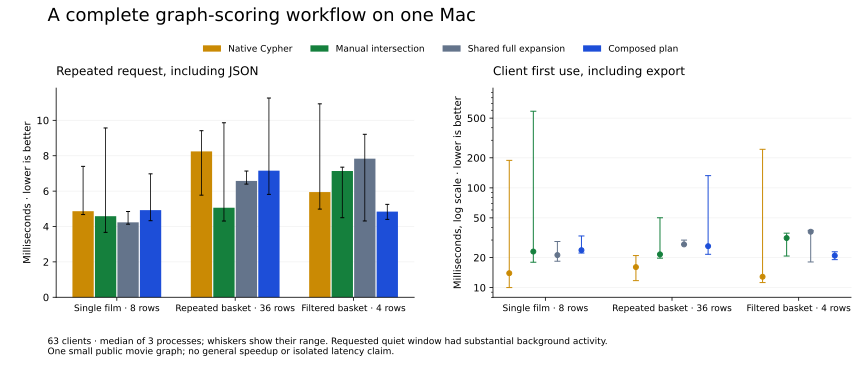

# Complete native Mac movie workflow

All **63 client processes / 504 calls** pass native-reference checks for scores,
status, provenance, row order and duplicate requests. The fixed workload and all
seven controls ran once; no timing-based reruns or outlier removal occurred.
The benchmark is complete, but **isolated performance remains unproven**.

The composed plan loses two of three repeated-request comparisons against the
fastest native/manual/shared-full on-demand control. Native Cypher has lower
median client first-use cost in all three. On this small graph, the convenience
and explicit contracts of composition do not establish a broad cost advantage.

## Main comparison

Each request number is the median of three process medians, each based on seven
complete calls. First use is the median of three client first-use observations.
A ratio above one favors the plan. These are descriptive timings on this machine.

| Workload | Rows | Plan request ms | Best on-demand request ms | Control | Control / plan | Plan first-use ms | Native first-use ms |
| --- | ---: | ---: | ---: | --- | ---: | ---: | ---: |
| single | 8 | 4.925 | 4.236 | full_source_shared | 0.860× | 23.719 | 13.946 |
| basket_with_repeat | 36 | 7.154 | 5.060 | manual_intersection | 0.707× | 26.018 | 16.054 |
| filtered_basket | 4 | 4.840 | 5.947 | native_cypher | 1.229× | 20.920 | 12.847 |

The 1.23× filtered-workload request ratio does not establish a statistically
reliable or general speedup. Only three processes were run per arm/workload;
background activity and database plan/cache state can affect results. The native
arm avoids an evidence export. The complete first-use comparison therefore
matters even when a repeated local request happens to be faster.

## Every control and setup cost

All values below are milliseconds except peak client RSS in MiB. Native
query/transfer includes its scoring; the local arms perform scoring in Python.
Warm pair-cache preparation includes its candidate query and scoring. Precomputed
scores are a favorable oracle; their preparation is separately charged.

| Workload | Arm | Request | First use | Snapshot export | Preparation | Peak client RSS MiB |
| --- | --- | ---: | ---: | ---: | ---: | ---: |
| single | full_source_shared | 4.236 | 21.190 | 12.273 | 0.081 | 72.703 |
| single | manual_intersection | 4.583 | 22.985 | 12.624 | 0.186 | 72.828 |
| single | native_cypher | 4.866 | 13.946 | 0.000 | 0.000 | 73.750 |
| single | plan | 4.925 | 23.719 | 12.050 | 0.090 | 72.797 |
| single | plan_unfused | 4.935 | 22.504 | 12.079 | 0.089 | 72.625 |
| single | precomputed_scores | 4.776 | 20.486 | 11.023 | 0.230 | 72.578 |
| single | warm_pair_cache | 3.768 | 22.734 | 10.065 | 5.294 | 72.875 |
| basket_with_repeat | full_source_shared | 6.573 | 27.101 | 14.781 | 0.091 | 72.906 |
| basket_with_repeat | manual_intersection | 5.060 | 21.546 | 10.634 | 0.184 | 73.703 |
| basket_with_repeat | native_cypher | 8.242 | 16.054 | 0.000 | 0.000 | 72.578 |
| basket_with_repeat | plan | 7.154 | 26.018 | 13.108 | 0.095 | 74.281 |
| basket_with_repeat | plan_unfused | 5.568 | 25.851 | 13.647 | 0.093 | 72.984 |
| basket_with_repeat | precomputed_scores | 6.140 | 32.043 | 16.916 | 0.293 | 72.953 |
| basket_with_repeat | warm_pair_cache | 5.599 | 26.575 | 10.277 | 6.204 | 72.797 |
| filtered_basket | full_source_shared | 7.833 | 36.311 | 20.511 | 0.092 | 72.734 |
| filtered_basket | manual_intersection | 7.138 | 31.407 | 16.900 | 0.238 | 72.594 |
| filtered_basket | native_cypher | 5.947 | 12.847 | 0.000 | 0.000 | 72.453 |
| filtered_basket | plan | 4.840 | 20.920 | 11.370 | 0.085 | 72.750 |
| filtered_basket | plan_unfused | 5.117 | 20.412 | 10.663 | 0.077 | 72.781 |
| filtered_basket | precomputed_scores | 5.713 | 26.264 | 14.189 | 0.298 | 72.688 |
| filtered_basket | warm_pair_cache | 4.680 | 27.332 | 11.530 | 6.331 | 72.547 |

[analysis.json](analysis.json) retains every process median and first-use value,
not just the medians in these tables. [results.json](results.json) is the unchanged
output of the frozen verifier. The archive retains every raw sample and work
report. No confidence interval claiming hardware/workload generalization is fitted.

## Host and timing boundary

Native Apple M5 Max, 128 GiB, macOS 26.6.2, Python 3.11.15, NumPy 2.4.6, Neo4j
Community 2026.09.0, driver 6.1.0, native Java 21.0.10. The installed runtime's
21 members match the frozen wheel; later packaging changed metadata only.

The operator requested a quiet window. The original campaign label is retained
as `quiet-window`, but observed summed process CPU was **367.7%–761.3%, median
460.05%**. 100% is approximately one logical CPU, not the entire 18-logical-CPU
Mac. This was not an idle or isolated session. Thermal telemetry reported no
recorded thermal/performance warning; that is not proof of isolation.

The first-use outliers shown in the figure remain included. One owned database
served all shuffled clients; its page and plan caches could warm across the run.
This is not a cold-server or concurrent throughput study. Full client first use
includes connection, export, preparation and first result encoding, but excludes
interpreter/library imports and telemetry. Parent subprocess wall time covers
all eight calls plus startup; the sum across clients was 24.996 seconds.
Database startup (4.714 seconds) and fixture import (5.868 seconds) are separate.
The database used 256 MiB heap / 64 MiB page cache. Client RSS does not include JVM
memory. The public movie projection has 140 nodes and 172 acting edges.

## Reproduction and audit

The [protocol](../../MOVIE_WORKFLOW_PROTOCOL.md), workload order, wheel, source,
software identity and native expected outputs were frozen before measurement.
Manifest SHA-256:
`14e36defbafcd71e549aae278daa2913c90ee8684520cdf17de3e9039fc244ee`.

The [85-file evidence archive](evidence.tar.gz) contains the complete campaign and
separate preflight. SHA-256:
`33717705f8c6b5dbde70cf8952d087ce08a1dbadb2e916b23ab7350068f1bf66`.
The original upstream `movies.cypher` is omitted from distribution. Restore it
using the pinned download/checksum instructions in the
[preflight report](../launch-preview-v2/FINDINGS.md) before a new execution.

Run `python -I audit.py` in this directory to reproduce [analysis.json](analysis.json)
without importing the runtime, executing archived scripts, starting a database,
or rerunning timings. The standard-library auditor checks file hashes, all
63 jobs, every returned record against frozen native output, output digests,
timing arithmetic, first-use boundaries, medians and the strongest-control ratios.
The native reference is the independent numerical oracle; the auditor does not
claim a second independently implemented Cypher engine.

[plot.py](plot.py) regenerates the SVG/PNG with Matplotlib. The figure shows the
four on-demand alternatives and their process ranges; the full table also retains
warm controls and the unfused ablation. Earlier preflight and mixed-use studies
remain unchanged. These results support a reproducible development preview,
not the original competitive 1.0 gates or a direct Quail throughput comparison.
